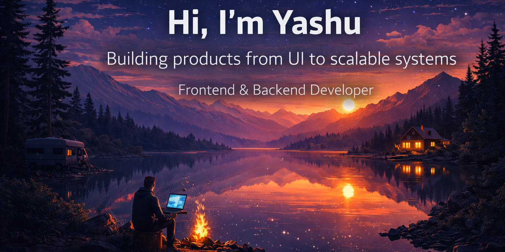

<!--Banner-->

  

<!--Header Name-->

#  Hi, I'm Yashu Youwaraj

_Turning complex requirements into clean, reliable software_

<!--Start Intro-->

<table width="100%" border="0" cellspacing="0" cellpadding="0">
  <tr>
    <td width="60%" valign="top">
      

        I'm a Full Stack Developer with a strong interest in backend and system-oriented development. I enjoy building scalable web applications, designing clean REST APIs, and working across the stack. I continuously improve my skills in Data Structures, Algorithms, and modern web technologies while focusing on writing clean, maintainable code.
      

<ul align="left">
  <li>💻 Full Stack Developer (Backend-focused)</li>
  <li>🌱 Continuous learner with a strong engineering mindset</li>
  <li>🤝 Open to collaboration and open-source contributions</li>
  <li>🧠 Actively improving DSA and system design fundamentals</li>
  <li>✍️ Sharing knowledge through technical content and mentorship</li>
  <li>💻 Visit my <a href="https://yashuyouwaraj.vercel.app" target="_blank">Portfolio</a> for more details</li>
</ul>

</td>

<td width="40%" align="right" valign="top">
  
</td>

  </tr>
</table>

<!--End Intro-->

<!--Profile Count Badge-->

  

<!--Languages and Tools Section-->

<h2 align="center">🛠️ Tech Stack</h2>

<picture>
  <source media="(prefers-color-scheme: dark)" srcset="./reference/Skills_Animation_Dark.gif">
  <source media="(prefers-color-scheme: light)" srcset="./reference/Skills_Animation_White.gif">
  
</picture>

 

<h3>💻 Languages</h3>

  
  
  
  
  

<h3>🎨 Frontend</h3>

  
  
  
  
  

<h3>⚙️ Backend</h3>

  
  
  
  

<h3>🗄️ Databases & ORMs</h3>

  
  
  
  
  

<h3>🔐 Auth & Security</h3>

  
  
  

<h3>🛠️ Tools & DevOps</h3>

  
  
  
  
  
  
  
  
  
  

<h3>🚀 Deployment & OS</h3>

  
  
  
  

<h3 align="left">📚 Current Focus</h3>

<ul align="left">
  <li>Building production-grade full stack applications</li>
  <li>Designing scalable backend services and APIs</li>
  <li>Strengthening Data Structures & Algorithms</li>
</ul>

<!--Github stats Table-->

<h2 align="center">📊 GitHub Analytics</h2> 

<table width="100%">
    <tr>
        <td width="50%"> 
            <h3 align="center"><strong>GitHub Stats</strong></h3> 
            

                
            

        </td>

        <td width="50%">
            <h3 align="center"><strong>Sᴛʀᴇᴀᴋ Sᴛᴀᴛs</strong></h3>
            
 
                 
            

        </td>
    </tr>

    <tr>
        <td width="50%">
            <h3 align="center"><strong>Top Languages</strong></h3>
            
 
                 
            

        </td>

        <td width="50%">
            <h3 align="center"><strong>Profile Summary</strong></h3>
            
 
                 
            

        </td>
    </tr>
</table>

<!--Contribution Graph-->

<h2 align="center">📈 Contribution Graph</h2>

  

<!--Trophies-->

<h2 align="center">🏆 Achievements</h2>

  

<!--Thought of the Day-->

<h2 align="center">✨ Tʜᴏᴜɢʜᴛ ᴏғ ᴛʜᴇ Dᴀʏ ✨</h2>

  

<!--Connect-->

<h2 align="center">🤝 Connect With Me</h2>

<!--Footer-->

  

